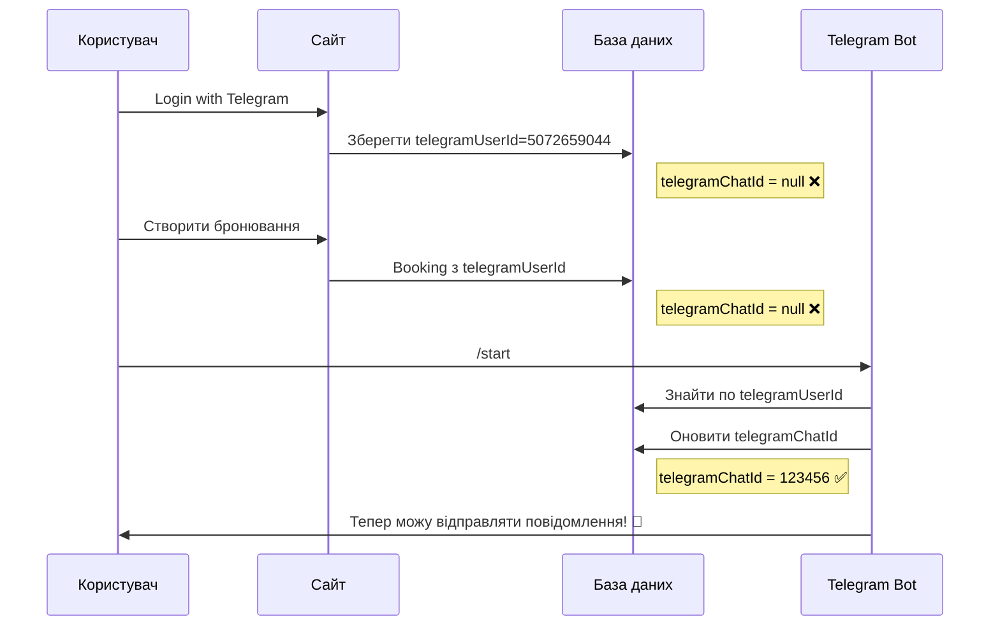
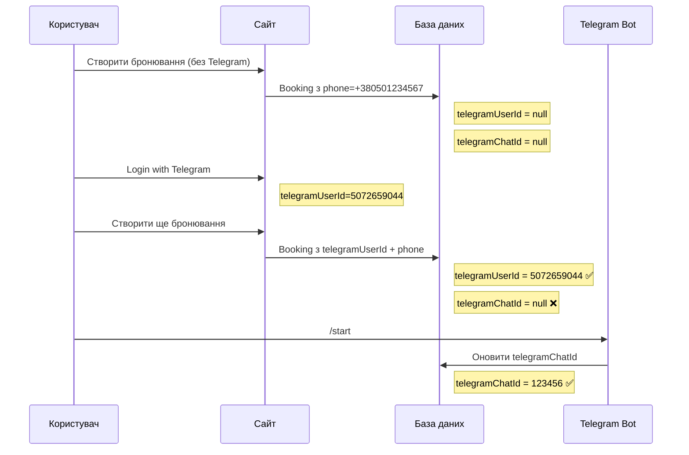
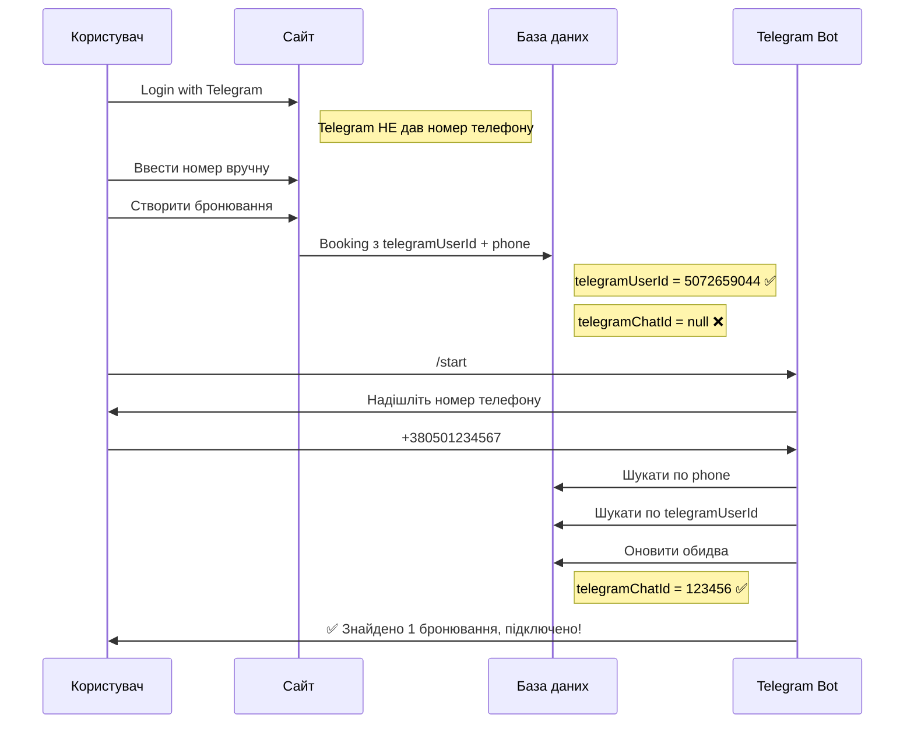

# Виправлення автоматичного оновлення telegramChatId

## 📋 Проблема

При використанні **Telegram Login Widget** на сайті:
- ✅ `telegramUserId` передається і зберігається
- ❌ `telegramChatId` залишається `null`

**Чому?**  
Telegram Login Widget надає тільки публічні дані користувача (`id`, `first_name`, `username`), але **НЕ надає `chat_id`**.

`chat_id` можна отримати **тільки** коли користувач взаємодіє з ботом:
- Пише повідомлення
- Натискає кнопку
- Викликає команду

---

## ✅ Рішення

Бот тепер **автоматично оновлює `telegramChatId`** для всіх бронювань користувача при будь-якій взаємодії.

### Місця автоматичного оновлення:

#### 1️⃣ **Команда `/start`**
```typescript
// Перевіряємо чи користувач вже зареєстрований
const existingBooking = await prisma.booking.findFirst({
  where: { telegramUserId: userId }
});

if (existingBooking) {
  // Оновлюємо telegramChatId для всіх бронювань користувача
  await prisma.booking.updateMany({
    where: { 
      telegramUserId: userId,
      telegramChatId: null // Тільки для тих що ще не мають chatId
    },
    data: { 
      telegramChatId: chatId
    }
  });
}
```

#### 2️⃣ **Команда `/mybookings`**
```typescript
// Оновлюємо telegramChatId перед показом бронювань
await prisma.booking.updateMany({
  where: { 
    telegramUserId: userId,
    telegramChatId: null
  },
  data: { 
    telegramChatId: chatId
  }
});
```

#### 3️⃣ **Функція `registerUserPhone()`**
```typescript
// 1. Шукаємо бронювання по номеру телефону
const matchingBookings = allBookings.filter(b => 
  normalizePhone(b.phone) === normalizedPhone
);

// 2. ТАКОЖ шукаємо бронювання по telegramUserId
const userIdBookings = await prisma.booking.findMany({
  where: { telegramUserId: userId }
});

// 3. Оновлюємо chatId для обох типів
for (const phone of phoneNumbers) {
  await prisma.booking.updateMany({
    where: { phone },
    data: { 
      telegramChatId: chatId,
      telegramUserId: userId
    }
  });
}

// 4. Оновлюємо chatId для бронювань створених через Telegram Login
await prisma.booking.updateMany({
  where: { 
    telegramUserId: userId,
    telegramChatId: null
  },
  data: { 
    telegramChatId: chatId
  }
});
```

---

## 🎯 Повний workflow

### Сценарій 1: Telegram Login → Бронювання → Бот



### Сценарій 2: Бронювання → Telegram Login → Бот



### Сценарій 3: Telegram Login → Бронювання → Реєстрація в боті



---

## 📊 Порівняння: До vs Після

### ❌ До виправлення:

| Етап | telegramUserId | telegramChatId | Може відправити повідомлення? |
|------|----------------|----------------|-------------------------------|
| Telegram Login на сайті | ✅ 5072659044 | ❌ null | ❌ НІ |
| Створення бронювання | ✅ 5072659044 | ❌ null | ❌ НІ |
| /start в боті | ✅ 5072659044 | ❌ null | ❌ НІ |
| Реєстрація номера | ✅ 5072659044 | ✅ 123456 | ✅ ТАК |

**Проблема:** Потрібно обов'язково реєструвати номер в боті!

---

### ✅ Після виправлення:

| Етап | telegramUserId | telegramChatId | Може відправити повідомлення? |
|------|----------------|----------------|-------------------------------|
| Telegram Login на сайті | ✅ 5072659044 | ❌ null | ❌ НІ |
| Створення бронювання | ✅ 5072659044 | ❌ null | ❌ НІ |
| /start в боті | ✅ 5072659044 | ✅ 123456 | ✅ ТАК ✨ |

**Виправлено:** Достатньо написати `/start` в боті!

---

## 🔍 Логування для діагностики

### Backend Console:

```bash
# При /start
✅ Оновлено telegramChatId для користувача 5072659044 при /start

# При registerUserPhone
✅ Оновлено telegramChatId для 3 бронювань користувача 5072659044

# При /mybookings
✅ Знайдено 2 майбутніх бронювань для користувача 5072659044
```

### Перевірка в БД:

```sql
-- Бронювання з telegramUserId але без chatId (проблемні)
SELECT id, phone, telegramUserId, telegramChatId 
FROM Booking 
WHERE telegramUserId IS NOT NULL 
  AND telegramChatId IS NULL;

-- Після виправлення - пусто! ✅
```

---

## 🎨 UX покращення

### Для користувача:

**Раніше:**
1. ❌ Логін через Telegram
2. ❌ Створює бронювання
3. ❌ Йде в бот
4. ❌ /start
5. ❌ Реєструє номер
6. ✅ Отримує повідомлення

**Зараз:**
1. ✅ Логін через Telegram
2. ✅ Створює бронювання
3. ✅ Йде в бот
4. ✅ /start
5. ✅ **ОДРАЗУ отримує повідомлення!** 🎉

---

## 🚀 Розгортання

**Коміт:** `d7f5a9e`  
**Статус:** ✅ Задеплоєно на Railway

**Зміни:**
- `backend/src/telegram.ts`: оновлено логіку команд та `registerUserPhone()`

**Тестування:**
1. Створити бронювання через Telegram Login на сайті
2. Перевірити БД: `telegramUserId` є, `telegramChatId` null
3. Написати `/start` в боті
4. Перевірити БД: `telegramChatId` тепер заповнений ✅

---

## 💡 Важливо розуміти

### Telegram Login Widget НЕ дає chat_id

**Що дає Telegram Login Widget:**
```typescript
{
  id: 5072659044,           // ✅ telegramUserId
  first_name: "Іван",       // ✅
  last_name: "Петренко",    // ✅
  username: "ivan_petrenko", // ✅
  photo_url: "...",         // ✅
  auth_date: 1234567890,    // ✅
  hash: "..."               // ✅
}
```

**Що НЕ дає:**
```typescript
{
  chat_id: ???  // ❌ НЕ надається!
}
```

### Як отримати chat_id?

**Єдиний спосіб:** користувач повинен написати боту або викликати команду.

Telegram API надає `chat_id` тільки в:
- `message.chat.id` - коли користувач пише повідомлення
- `callback_query.message.chat.id` - коли натискає inline кнопку
- Будь-якій іншій взаємодії з ботом

---

## ✅ Висновок

**Проблема вирішена!** 🎉

Тепер `telegramChatId` автоматично оновлюється при першій взаємодії користувача з ботом, навіть якщо бронювання створене через Telegram Login на сайті.

**Переваги:**
- ✅ Не потрібно реєструвати номер окремо
- ✅ Достатньо написати `/start`
- ✅ Працює для всіх існуючих бронювань
- ✅ Оновлюється автоматично при будь-якій команді
- ✅ Повна синхронізація між сайтом і ботом

---

**Дата виправлення:** 27 січня 2026  
**Commit:** `d7f5a9e`
